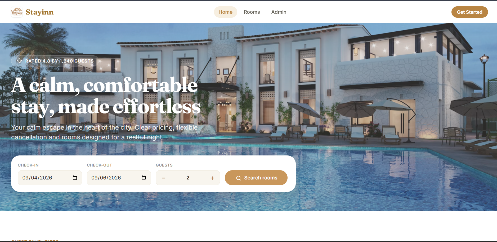

# Stayinn

<p align="center">
  
</p>

<h1 align="center">Stayinn</h1>

<p align="center">
  A modern room booking web application built with React and Firebase.
</p>

<p align="center">
  <a href="https://stayinn-3a715.web.app">Live Demo</a>
  &nbsp;&nbsp;•&nbsp;&nbsp;
  <a href="https://github.com/CodedByManish/Stayinn">Repository</a>
</p>

<p align="center">
  
  
  
  
</p>

---

## Overview

**Stayinn** is a responsive room booking platform designed to provide a simple and modern hotel booking experience.

Users can explore rooms, view details, authenticate, make bookings, and receive confirmation. The application also includes an administrative dashboard.

---

## Preview

<p align="center">
  
</p>

---

## Features

| User Experience         | Management              |
| ----------------------- | ----------------------- |
| Browse available rooms  | Admin dashboard         |
| Room details            | Booking management      |
| Booking workflow        | Room management         |
| Booking confirmation    | Administrative controls |
| Firebase authentication | Firebase integration    |
| Responsive design       | Production deployment   |

---

## Tech Stack

```text
Frontend       React + Vite
Language       JavaScript
Styling        CSS
Authentication Firebase Authentication
Hosting        Firebase Hosting
CI/CD          GitHub Actions
Version Control Git + GitHub
```

---

## Quick Start

### 1. Clone

```bash
git clone https://github.com/CodedByManish/Stayinn.git
cd Stayinn
```

### 2. Install

```bash
npm install
```

### 3. Configure

Create a `.env` file using `.env.dist` as the reference.

### 4. Run

```bash
npm run dev
```

Open:

```text
http://localhost:5173
```

---

## Build & Deploy

Build the production application:

```bash
npm run build
```

Deploy to Firebase Hosting:

```bash
firebase deploy --only hosting
```

### Live Application

<p align="center">

**https://stayinn-3a715.web.app**

</p>

---

## Documentation

| Guide                            | Description                         |
| -------------------------------- | ----------------------------------- |
| [Setup](docs/SETUP.md)           | Development setup and configuration |
| [Deployment](docs/DEPLOYMENT.md) | Firebase and GitHub Actions         |
| [Usage](docs/USAGE.md)           | User and admin guide                |

---

## Project Structure

```text
Stayinn/
├── src/
│   ├── components/
│   └── pages/
│       ├── Admin.jsx
│       ├── Booking.jsx
│       ├── Confirmation.jsx
│       ├── Home.jsx
│       ├── RoomDetails.jsx
│       └── Rooms.jsx
│
├── docs/
│   ├── SETUP.md
│   ├── DEPLOYMENT.md
│   ├── USAGE.md
│   └── screenshots/
│       └── stayinn-home.png
│
├── .github/
│   └── workflows/
│
├── firebase.js
├── firebase.json
├── package.json
├── styles.css
├── vite.config.js
└── README.md
```

---

## Developer

<p align="center">
  <strong>Manish Kafle</strong><br>
  React Developer
</p>

<p align="center">
  <a href="https://github.com/CodedByManish">
    GitHub
  </a>
  &nbsp;&nbsp;•&nbsp;&nbsp;
  <a href="https://github.com/CodedByManish/Stayinn">
    Stayinn Repository
  </a>
</p>

---

<p align="center">
  <sub>Stayinn — Modern room booking, simplified.</sub>
</p>
